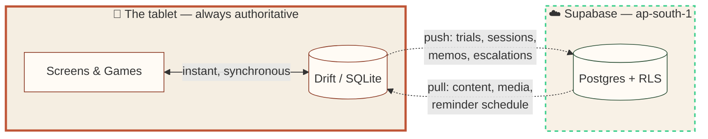
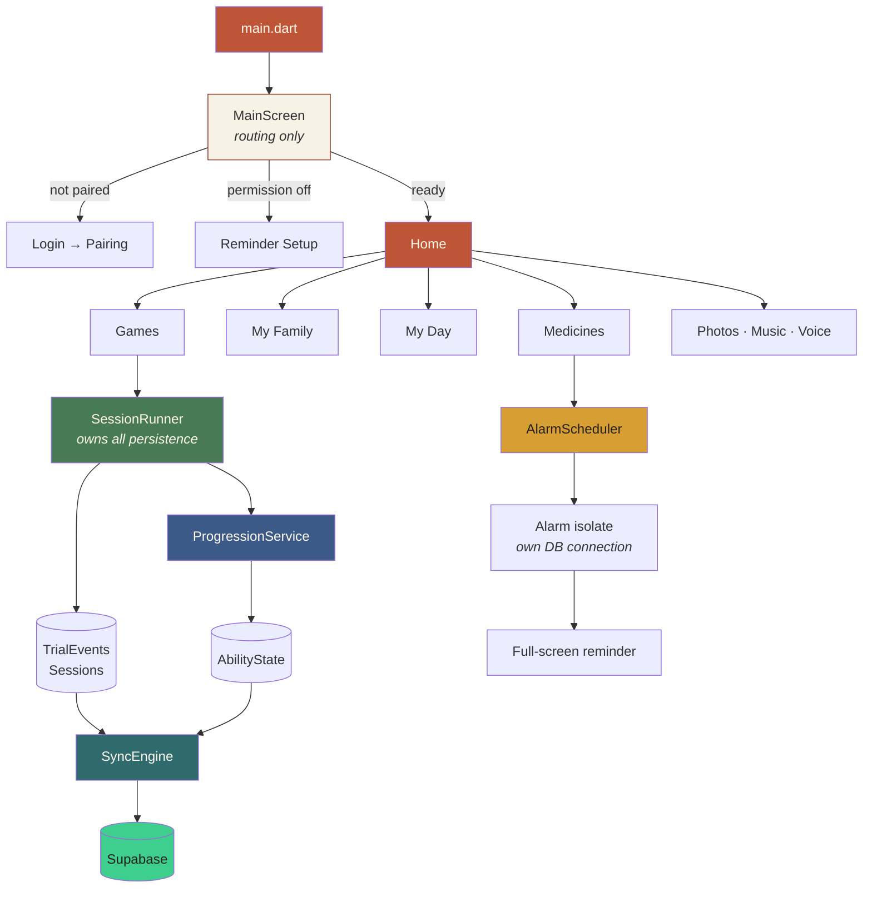
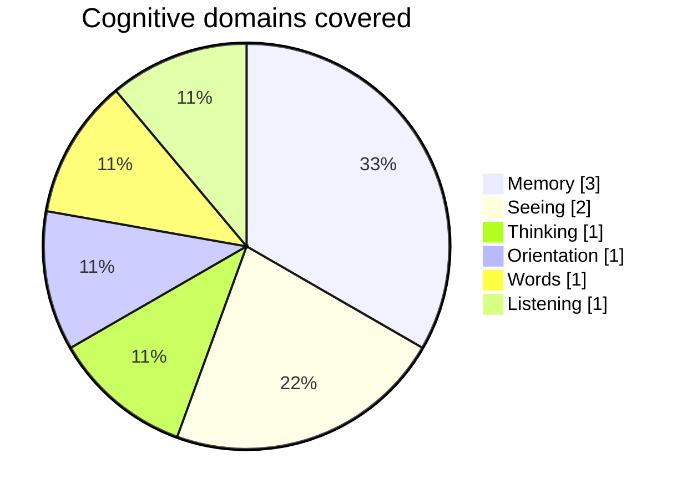
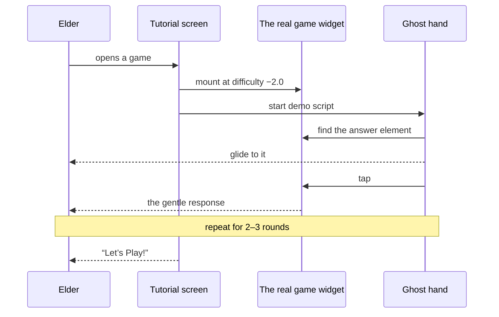
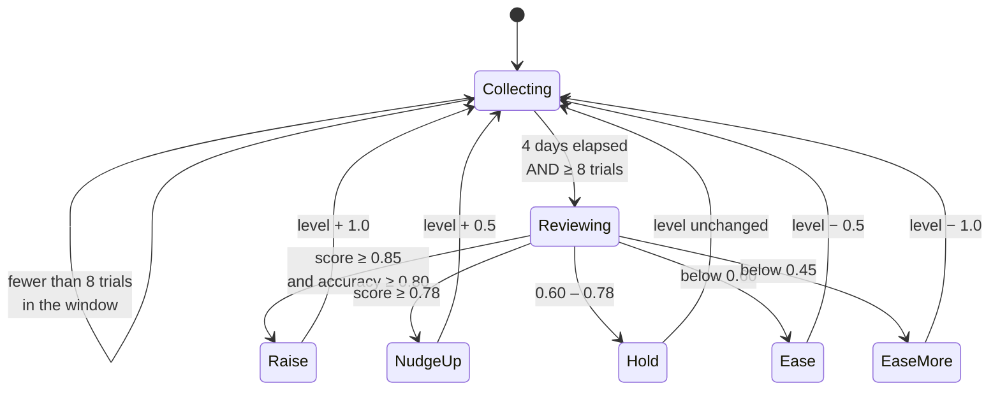
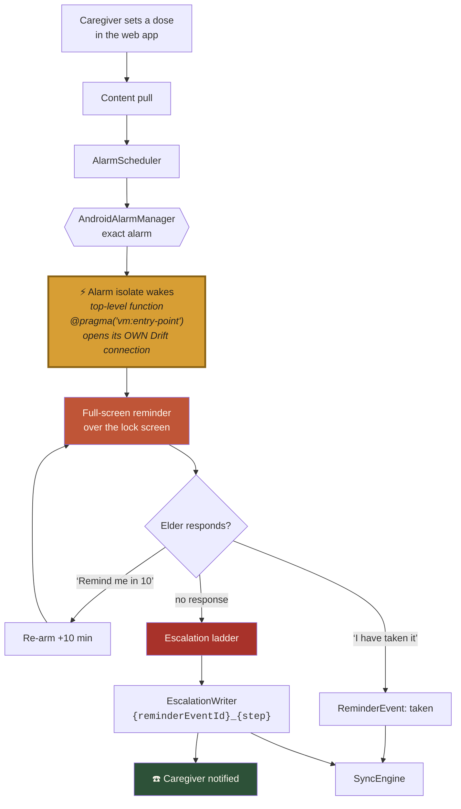
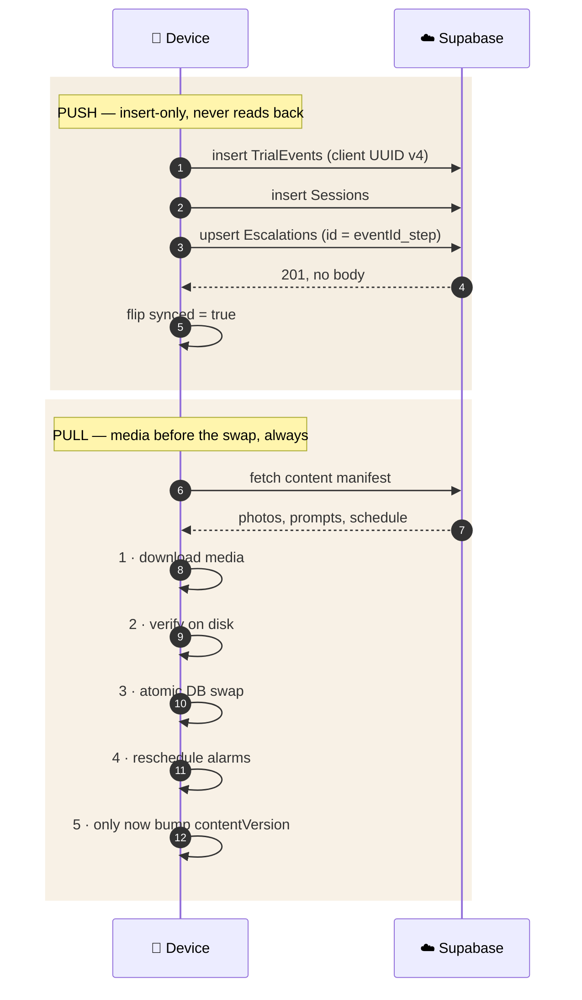
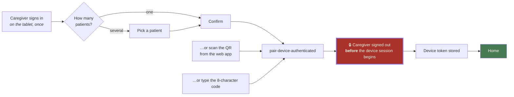

<div align="center">


<br>


<br>


</div>

---

> **smṛti** (Sanskrit, *स्मृति*) — *“that which is remembered.”*
>
> A tablet that sits on a table in a home in North-East India. An elder living
> with dementia picks it up. It greets them by name, shows them the faces of
> their family, reminds them to take their medicine, and offers a few gentle
> games. It never tells them they got something wrong. It never shows them an
> error. It works when the internet does not.

---

## Contents

| | | |
|---|---|---|
| [What this is](#what-this-is) | [The one principle](#-the-one-principle) | [Architecture](#-architecture) |
| [The nine games](#-the-nine-games) | [How difficulty moves](#-how-difficulty-moves) | [Reminders](#-reminders-that-actually-fire) |
| [Sync](#-sync-local-first-in-practice) | [Pairing](#-pairing-a-device) | [Design language](#-the-design-language) |
| [Repo map](#-repo-map) | [Getting started](#-getting-started) | [The rules](#-the-rules-that-cannot-be-broken) |

---

## What this is

Smriti is a Flutter app for a **single elderly user living with dementia**, set
up and monitored by a family caregiver from a separate web app. It is
voice-first, offline-first, and kiosk-locked.

Three things make it different from a generic "brain training" app:

<table>
<tr>
<td width="33%" valign="top">

### 🪔 It never corrects
A wrong answer returns the card silently with a neutral tone. No red, no
buzzer, no "incorrect", no score shown to the elder. Ever.

</td>
<td width="33%" valign="top">

### 📊 It measures anyway
Every trial records reaction time, movement time, perseverative errors and
switch cost. The caregiver sees the trend. The elder sees a game.

</td>
<td width="33%" valign="top">

### 🔌 It assumes no network
Every screen reads local SQLite. Supabase is somewhere data *goes*, never
somewhere a screen waits on.

</td>
</tr>
</table>

---

## 🧭 The one principle

> **SQLite (Drift) on the tablet is the source of truth. Supabase is a sync
> destination, not a database you query to render a screen.**

If an `await supabase...` ever appears inside a widget `build` method or a
game's logic, the design has gone wrong. Only `lib/core/sync/` and
`lib/core/auth/` are allowed to import `supabase_flutter` at all.



The dotted arrows are the only ones that can fail. Nothing on screen is behind
one.

---

## 🏛 Architecture



<details>
<summary><b>📂 What lives in <code>lib/core/</code> — click to open</b></summary>

<br>

| Module | Responsibility | May import Supabase? |
|---|---|:---:|
| `db/` | Drift tables, database, DAOs. The source of truth. | ❌ |
| `repo/` | Read/write façades over the DAOs that screens use. | ❌ |
| `progression/` | Difficulty policy, level scale, play policy, scoring. | ❌ |
| `reminders/` | Alarm scheduling, the alarm isolate, permissions, health checks. | ❌ |
| `ability/` | Ability estimation from trial history. | ❌ |
| `i18n/` | `AppStrings` + `LocaleController`. 17 language codes. | ❌ |
| `speech/` | Speech recognition, wrapped so an unavailable microphone degrades quietly. | ❌ |
| `files/` | On-disk paths for downloaded media. | ❌ |
| **`sync/`** | Event push, content pull, media download, heartbeat. | ✅ |
| **`auth/`** | Device pairing and token handling. | ✅ |

Two modules out of ten touch the network. That is the whole design.

</details>

---

## 🎲 The nine games

Each game emits a `TrialResult` to the **session runner**, which owns every
side effect: persistence, the session cap, hint escalation, and the ghost-hand
demo. *Games never touch the database.*

| # | Game | Domain | What it actually measures |
|:-:|---|---|---|
| 1 | **Faces of My Family** | 🧠 Memory | Recognition → free naming → relationship → last contact, with a timed photo reveal |
| 2 | **Market Basket** | 🧠 Memory | Study/delay/recall with a filled delay; false positives on the shelf |
| 3 | **Lamps of the Festival** | 🧠 Memory | Forward span over a lit sequence of diyas |
| 4 | **Sort the Harvest** | 🧩 Thinking | Wisconsin-style set shifting — a persistent rule, perseverative vs. non-perseverative errors, switch cost |
| 5 | **Trace the Path** | 👁 Seeing | Visuospatial sequencing across river stones |
| 6 | **Weaving Patterns** | 👁 Seeing | Pattern matching on woven gamosa strips |
| 7 | **My Day** | 🧭 Orientation | Ordering the day's routine; time-of-day awareness |
| 8 | **Name the Harvest** | 💬 Words | Category fluency — speech-first, with fuzzy matching for repeats and off-category answers |
| 9 | **Sounds of Home** | 👂 Listening | Auditory discrimination and response inhibition |



<details>
<summary><b>🖐 How a game teaches itself — the ghost hand</b></summary>

<br>

`GameTutorialScreen` does **not** play a recording or a mock-up. It runs the
**real game widget** on its easiest items inside a phone-shaped frame, with a
translucent hand that walks the element tree, finds the correct answer, moves
to it and taps it.

Because it is the real game, the tutorial can never drift out of date when the
game changes.



And once play begins, a **30-second idle hint** wakes: a marigold ring that
breathes around the answer. Never red. Never a shake.

</details>

---

## 📈 How difficulty moves

Difficulty is a **continuous level**, not a set of tiers, and it is reviewed on
a **per-game 4-day clock that starts the first time that game is played** — not
on a global calendar.



| Decision | Trigger | Step | Notes |
|---|---|:-:|---|
| `raise` | score ≥ **0.85** and accuracy ≥ **0.80** | **+1.0** | halved to +0.5 if it was eased recently |
| `nudgeUp` | score ≥ **0.78** | **+0.5** | |
| `hold` | **0.60 – 0.78** | 0 | the intended resting band |
| `ease` | below **0.60** | **−0.5** | |
| `easeMore` | below **0.45** | **−1.0** | |
| `notEnoughData` | fewer than **8** trials in the window | 0 | 3 for long-form games |

<details>
<summary><b>⚠️ “It’s been four days and nothing changed” — why that is usually correct</b></summary>

<br>

Both conditions must hold, **per game**:

1. four days have passed since *that game's* first play, and
2. at least **8 trials** of *that game* sit inside the window.

Eight trials spread across nine games is one trial each — nowhere near the
threshold for any of them. `lastDecision` will read `notEnoughData` and the
level will not move. That is the system working, not failing. The diagnostics
screen shows the trial count per game so this is checkable rather than
mysterious.

</details>

<details>
<summary><b>🪜 The in-session staircase — difficulty inside a single sitting</b></summary>

<br>

Between reviews, difficulty still adapts *within* a session, but only a little:

| Knob | Value |
|---|:-:|
| Step down after | **2** consecutive misses |
| Step up after | **3** consecutive hits |
| Step size | **± 0.5** |
| Maximum offset from the reviewed level | **± 1.0** |

The clamp matters: the staircase makes a session feel right, it does not let a
bad ten minutes rewrite a considered four-day judgement.

</details>

<details>
<summary><b>🛑 The rest policy — why play stops</b></summary>

<br>

- A single session counts at most **8 minutes** toward the daily total, however
  long the tablet is actually held.
- Past the daily budget, games take a **restful break** — framed as the games
  resting, never as the elder being limited.
- The elder is offered My Family or My Day instead. The door is never just shut.

</details>

---

## ⏰ Reminders that actually fire

The hardest engineering problem in this app is not the games — it is getting an
Android alarm to wake a locked, battery-optimised, OEM-skinned tablet **on
time, every time.**



> [!WARNING]
> **The alarm isolate shares nothing with the main isolate.** No Riverpod
> container, no existing DB instance, no static set in `main()`. It is a
> top-level function annotated `@pragma('vm:entry-point')` that opens its own
> Drift connection. Anything captured from the main isolate will be `null` when
> the alarm actually fires — and it will look fine in debug.

> [!CAUTION]
> **Test every reminder change on a real Android device.** An emulator does not
> reproduce OEM battery-optimisation behaviour and will hand you false
> confidence. Xiaomi, Vivo and Oppo each need their own permission journey; the
> app deep-links to them where it can and falls back to the standard Android
> settings page everywhere else.

---

## 🔄 Sync: local-first in practice



> [!IMPORTANT]
> Device writes **never** use `.select()` or chain a `RETURNING`. The device's
> Supabase identity has insert-only access, so a read-back fails with a
> misleading *"violates row-level security policy"* error — even though the
> insert succeeded. Use bare `.insert()` / `.upsert(..., ignoreDuplicates: true)`.

| Table | Write mode | The only permitted UPDATE |
|---|---|---|
| `TrialEvents` | INSERT-only | flipping `synced` |
| `Sessions` | INSERT-only | `synced`, plus `endedAt`/`completed` while still open |
| `ReminderEvents` | INSERT-only | flipping `synced` |
| `VoiceMemos` | INSERT-only | flipping `synced` |

A finalised row is never mutated. The history is the evidence.

---

## 🔗 Pairing a device



The pairing alphabet is exactly:

```
ACDEFGHJKLMNPQRSTUVWXYZ2345679
```

No `B`, `I`, `O`, `0`, `1` or `8` — every pair a tired person confuses at a
kitchen table, removed. The code boxes reject anything outside it as you type,
so a bad character never reaches the server.

---

## 🎨 The design language

The palette is North-East India: fired clay, marigold, indigo dye, tea, the red
selvedge of a **gamosa**. Nothing is grey, and nothing is corporate blue.



| Token | Where it belongs |
|---|---|
| `terracotta` | Home, and the one primary action on a screen |
| `indigo` | My Family, Photos |
| `marigold` | My Day, Music, and every hint in every game |
| `leafGreen` | Medicines, and anything meaning “done” |
| `riverTeal` | Voice messages |
| `gamosaRed` | The woven selvedge, Weaving Patterns |
| `pageBackground` | The cloth everything else sits on |

Type is large by design — body text does not go below 18sp, nothing at all
below 15sp, and every tap target is at least 56dp. Separation is done with
**light and hairlines, not outlines**: a card is lifted off the page by a soft
shadow tinted with its own colour.

> [!NOTE]
> `docs/UI_REDESIGN_PLAN.md` is a full specification for a further visual pass —
> tokens, five box types, six button types, per-game and per-screen design, and
> an accessibility checklist. It describes intended work, not the current state
> of `lib/`.

---

## 🗺 Repo map

```
smriti/
├── lib/
│   ├── main.dart
│   ├── app_colors.dart              # the whole palette, one file
│   │
│   ├── core/
│   │   ├── db/                      # Drift tables, database, DAOs  ← source of truth
│   │   ├── repo/                    # façades the screens actually call
│   │   ├── progression/             # 4-day review, level scale, play policy
│   │   ├── reminders/               # alarms, the isolate, permissions, health
│   │   ├── ability/                 # ability estimation
│   │   ├── i18n/                    # AppStrings · LocaleController
│   │   ├── speech/                   # recognition in, with a graceful fallback
│   │   ├── files/                   # on-disk media paths
│   │   ├── sync/         🌐         # the only network module
│   │   └── auth/         🌐         # pairing
│   │
│   ├── games/
│   │   ├── game_catalog.dart        # the nine, their colours and domains
│   │   ├── session_runner.dart      # owns persistence, the cap, hints
│   │   ├── cognitive_game.dart      # the contract every game implements
│   │   ├── ghost_hand.dart
│   │   ├── hint/                    # the 30-second idle hint
│   │   ├── tutorial/                # the real game, playing itself
│   │   ├── ui/                      # chrome shared by all nine
│   │   └── <nine game folders>/     # *_game.dart = logic · *_widget.dart = screen
│   │
│   ├── screens/                     # 16 + pairing/ (4)
│   └── ui/                          # smriti_ui · motion · textures · day_scene
│
├── docs/
│   ├── APP-BUILD-SPEC.md            # the spec. read the relevant section first
│   ├── PROGRESSION_PLAN.md          # cited from source comments
│   ├── TASKS.md                     # the current task and its acceptance criteria
│   └── UI_REDESIGN_PLAN.md          # a proposed visual pass (not yet in lib/)
│
├── test/                            # 35 test files
├── tool/render/                      # renders screens to PNG with no device attached
└── AGENTS.md                        # the rules, for humans and agents alike
```

---

## 🚀 Getting started

```bash
flutter pub get
dart run build_runner build --delete-conflicting-outputs   # Drift codegen
flutter run
```

<details>
<summary><b>🔑 Configuration</b></summary>

<br>

The Supabase project is **already built, deployed and live-tested** — schema,
RLS, pairing functions, escalation calls and the watchdog. You are not building
a backend.

The anon key is **not** in this repo. Ask whoever is running the project for it;
never invent one, and never commit it.

</details>

<details>
<summary><b>🧪 Tests, analysis and screenshots without a device</b></summary>

<br>

```bash
flutter analyze                                   # must be clean
flutter test                                      # the suite

# every elder-facing screen at 320×560 and at 412×915 with the
# system font at 1.5×, failing on any RenderFlex overflow
flutter test test/screens/elder_screen_layout_test.dart

# render each screen to build/render/*.png with no phone attached
flutter test tool/render/render_screens.dart
```

`tool/render/` is a developer aid, not part of the suite — `flutter test` with
no path does not reach it. Each shot writes its PNG immediately and then sits in
teardown, so read the PNGs and ignore the tally.

</details>

<details>
<summary><b>📱 Building for a device</b></summary>

<br>

```bash
flutter build apk --release
adb install -r build/app/outputs/flutter-apk/app-release.apk   # -r keeps the data
```

Target every Android phone and version — `minSdk 24`, `target 36`. Manufacturer
deep links (Xiaomi, Vivo, Oppo permission pages) are optional extras with a
generic fallback, never something a feature depends on.

</details>

---

## 🚫 The rules that cannot be broken

These are load-bearing. `AGENTS.md` holds the full list; these are the ones that
bite hardest.

| # | Rule |
|:-:|---|
| 1 | Nothing outside `lib/core/sync/` and `lib/core/auth/` imports `supabase_flutter`. |
| 2 | Event, session, memo IDs are client-generated **UUID v4**. Escalation IDs are deterministic: `{reminderEventId}_{step}`. |
| 3 | `TrialEvents`, `Sessions`, `ReminderEvents`, `VoiceMemos` are **INSERT-only**. Never mutate a finalised row. |
| 4 | Device writes to Supabase never `.select()` or `RETURNING`. |
| 5 | Content pull order is **media → verify on disk → atomic DB swap → reschedule alarms**. Never bump `contentVersion` first. |
| 6 | Alarm callbacks are top-level, `@pragma('vm:entry-point')`, and open their own DB connection. |
| 7 | The pairing alphabet is copied verbatim from the spec, never retyped. |
| 8 | The caregiver session is signed out **before** the device session is established. |
| 9 | Connectivity, sync status, battery optimisation and errors are **never** shown to the elder — only behind hidden diagnostics. |
| 10 | Games never touch the database. They emit a `TrialResult` to the session runner. |
| 11 | The app never says *“wrong”*, shows red, or plays a negative sound. Cards return silently, in a neutral tone. |
| 12 | Every reminder change is tested on a **real Android device**. |

---

<div align="center">


**Smriti** · _built for families who live far from home, and for the parents who raised them._

<sub>Specs live in <a href="docs/APP-BUILD-SPEC.md"><code>docs/</code></a> ·
contributor rules in <a href="AGENTS.md"><code>AGENTS.md</code></a> ·
photography credited in <a href="assets/images/photos/CREDITS.md"><code>assets/images/photos/CREDITS.md</code></a></sub>

</div>
