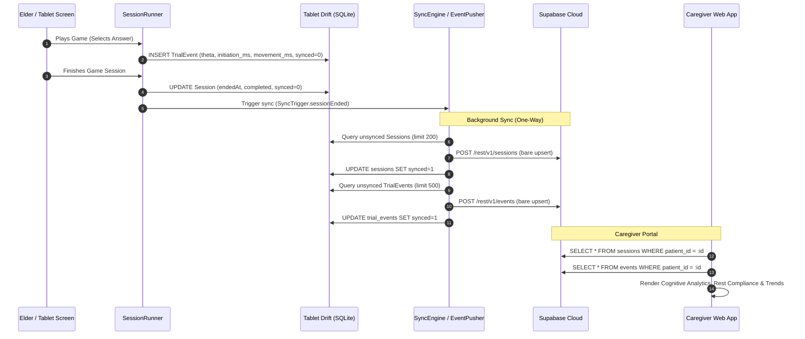

# Smriti Elder App: Game Data Synchronization & Web Dashboard Architecture

This document provides a comprehensive technical walkthrough of how game data created by the elder on the tablet is stored, synchronized with the Supabase cloud backend, and rendered on the Caregiver Web Application.

---

## 1. Architectural Philosophy: The Local-First Principle

The Smriti tablet application is designed for dementia care in North-East India, where connectivity can be intermittent or absent for extended periods.

```
┌─────────────────────────────────────────────────────────┐
│                     SMRITI TABLET                       │
│                                                         │
│   ┌────────────────┐      ┌─────────────────────────┐   │
│   │ Game Widgets   │ ───> │ SessionRunner           │   │
│   │ & Activities   │      │ (owns trials & timers)  │   │
│   └────────────────┘      └───────────┬─────────────┘   │
│                                       │ Writes          │
│                                       ▼                 │
│                           ┌─────────────────────────┐   │
│                           │ Drift / SQLite Database │   │
│                           │ (Single Source of Truth)│   │
│                           └───────────┬─────────────┘   │
└───────────────────────────────────────┼─────────────────┘
                                        │ Reads unsynced rows
                                        ▼ (Background Only)
┌─────────────────────────────────────────────────────────┐
│                      SYNC LAYER                         │
│             (EventPusher & SyncEngine)                  │
└───────────────────────────────────────┬─────────────────┘
                                        │ HTTPS / WSS
                                        ▼ (Insert-Only Upsert)
┌─────────────────────────────────────────────────────────┐
│                   SUPABASE BACKEND                      │
│            PostgreSQL + Row-Level Security              │
└───────────────────────────────────────┬─────────────────┘
                                        │ SQL Queries & Realtime
                                        ▼
┌─────────────────────────────────────────────────────────┐
│                 CAREGIVER WEB APPLICATION               │
│   • Cognitive Trend Charts   • Reaction Time Analytics  │
│   • Daily Rest Tracking      • Progression Reports      │
└─────────────────────────────────────────────────────────┘
```

### Non-Negotiable Core Rule
**SQLite (via Drift) on the tablet is the single source of truth.**
No game screen, audio prompt, or UI component ever waits for an HTTP request or queries Supabase directly. All gameplay, levels, and diagnostics read and write directly to the local SQLite database. Syncing to Supabase is strictly a one-way, background operation.

---

## 2. The Data Flow: Step-by-Step Lifecycle

### Step 1: Session Initialization & Trial Generation
1. When the elder selects a game (e.g., *Market Basket*), `GameScreen` initializes `SessionRunner`.
2. `SessionRunner.start([game])` creates a new row in the local SQLite `Sessions` table:
   - Client-generated UUID v4 (`id`)
   - `startedAt` (epoch milliseconds)
   - `gameIds` (`market_basket`)
   - `completed = false`
   - `synced = false`
3. As the elder plays, every round emits a `TrialResult` to `SessionRunner`.
4. `SessionRunner` computes the decision metrics and writes an INSERT-only row to SQLite `TrialEvents`:
   - `sessionId`: references the active session
   - `gameId` & `cognitiveDomain`: e.g. `memory`
   - `itemId` & `itemDifficulty`: calibrated difficulty of the item
   - `thetaBefore`: elder's cognitive ability score ($\theta$) before this round
   - `correct`: boolean success
   - `initiationMs`: time from item presentation to the elder's first screen touch (decision processing speed)
   - `movementMs`: time from first touch to answer release (fine motor speed)
   - `responseTimeMs`: total elapsed trial time
   - `hintLevel`: level of ghost-hand or audio assistance needed (0, 1, 2)
   - `metrics`: JSON metadata specific to the game (e.g. card targets, choices, spans)
   - `synced = false`

### Step 2: Session Finalization
When the session finishes (either reaching the 6-minute cap, the elder tapping "Rest now", or exiting):
1. `_endSession()` calls `await runner.end(completed: isCapReached)`.
2. `endedAt` and `completed` are committed to SQLite. If exited prematurely, `abandonedAtMs` records the active duration.
3. The session runner triggers the sync engine:
   ```dart
   unawaited(SyncEngine.defaultInstance.run(trigger: SyncTrigger.sessionEnded));
   ```

---

## 3. Background Sync Engine (`EventPusher`)

The sync engine runs entirely asynchronously in the background. It is triggered by:
- **Session End**: Immediately upon completing any gameplay session.
- **Network Reconnection**: Whenever Android reports an active internet connection (`connectivity_plus`).
- **Periodic WorkManager**: Scheduled background worker running every 15 minutes.
- **App Foregrounding**: When the app transitions from background to foreground.

### Sync Execution Order & Foreign Key Integrity
`EventPusher.push()` executes in strict relational sequence:

```
1. Push Unsynced Sessions
   └── Supabase table: `sessions`
       └── Must exist first because events reference session_id

2. Push Unsynced Trial Events
   └── Supabase table: `events`
       └── Foreign key: session_id -> sessions.id

3. Push Unsynced Reminder Events
   └── Supabase table: `reminder_events`
       └── Medication adherence & ladder step responses
```

### The Insert-Only Security Contract (AGENTS.md Rule #4)
The tablet authenticates with Supabase using a specialized device JWT token (`is_device = true`, `patient_id = <uuid>`).
Under PostgreSQL Row-Level Security (RLS), the tablet identity has **INSERT-ONLY** privileges on data tables.
- **Never `.select()` or chain `.select()` after write**: If the app writes `.insert().select()`, Supabase attempts to read back the written row, which triggers an RLS read violation error even though the write succeeded!
- The app uses bare upserts:
  ```dart
  await client.from('events').upsert(
    rows,
    onConflict: 'id',
    ignoreDuplicates: true,
  );
  ```
- Only after Supabase returns HTTP 200/201 does the local repository flip the flag in SQLite:
  ```sql
  UPDATE trial_events SET synced = 1 WHERE id IN (...);
  ```

---

## 4. Supabase Database Schema Mapping

| SQLite (Drift) Table | Supabase Backend Table | Primary Key | Critical Payload Fields |
| :--- | :--- | :--- | :--- |
| `Sessions` | `sessions` | UUID v4 | `id`, `patient_id`, `started_at`, `ended_at`, `game_ids`, `completed`, `abandoned_at_ms`, `demo_replays` |
| `TrialEvents` | `events` | UUID v4 | `id`, `session_id`, `patient_id`, `game_id`, `domain`, `item_id`, `item_difficulty`, `theta_before`, `correct`, `initiation_ms`, `movement_ms`, `response_time_ms`, `hint_level`, `metrics` (JSON), `ts` |
| `ReminderEvents` | `reminder_events` | UUID v4 | `id`, `patient_id`, `medication_id`, `scheduled_at`, `fired_at`, `responded_at`, `outcome`, `channel`, `ladder_step` |
| `VoiceMemos` | `memos` | UUID v4 | `id`, `patient_id`, `recorded_at`, `duration_ms`, `storage_path` (points to Supabase Storage bucket `patient-memos`) |
| `EscalationRequests` | `escalations` | Deterministic `{reminderEventId}_{step}` | `id`, `patient_id`, `status` (`requested`), `recipient_phone`, `step_index` |

---

## 5. How the Caregiver Web App Displays Game Data

Caregivers log into the web application using their personal authenticated credentials.
PostgreSQL RLS grants caregivers full read access to any patient assigned to their family group.

The Web App queries Supabase directly to power the caregiver dashboard:

```
┌────────────────────────────────────────────────────────────────────────┐
│                   CAREGIVER WEB DASHBOARD VIEW                         │
├──────────────────────────────────┬─────────────────────────────────────┤
│ 1. DAILY ENGAGEMENT & REST       │ 2. COGNITIVE DOMAIN RADAR           │
│    • Total Play Today: 32 mins   │    • Memory: 82% (Market Basket)    │
│    • Sessions: 5 sessions        │    • Visuospatial: 74% (Trace Path) │
│    • Rest Breaks Taken: 2        │    • Executive: 68% (Sort Harvest)  │
│    • "Keep Playing" Overrides: 1 │    • Attention: 85% (Sounds of Home)│
├──────────────────────────────────┼─────────────────────────────────────┤
│ 3. ABILITY PROGRESSION (IRT θ)   │ 4. MOTOR VS COGNITIVE REACTION TIME │
│    [📈 Linear Growth Chart]      │    [📊 Dual Bar Breakdown]          │
│    Tracks longitudinal stability │    Separates Initiation (thinking)  │
│    over 4-day review cycles.     │    from Movement (motor speed).     │
└──────────────────────────────────┴─────────────────────────────────────┘
```

### 1. Daily Play & Rest Compliance
- **Source**: `sessions` table filtered by `patient_id` and `started_at >= today_midnight`.
- **Calculations**:
  $$\text{Total Active Play Time} = \sum (\text{ended\_at} - \text{started\_at})$$
- **What it tells the caregiver**:
  - Whether the elder is getting regular cognitive stimulation without overexertion.
  - Number of sessions completed vs. abandoned.
  - Compliance with rest reminders (shown vs kept playing).

### 2. Cognitive Domain Analytics
- **Source**: `events` grouped by `domain` and `game_id`.
- **Calculations**:
  - Accuracy rate: $\frac{\text{correct trials}}{\text{total trials}}$
  - Average hint assistance required per game ($0 = \text{independent}$, $1 = \text{audio nudge}$, $2 = \text{ghost hand demo}$).
- **What it tells the caregiver**:
  - Identifies which cognitive faculties are sharp (e.g. attention, memory) and which need reinforcement or gentle ease.

### 3. Cognitive Trajectory & Ability Estimator ($\theta$)
- **Source**: `events.theta_before` and `item_difficulty`.
- **IRT (Item Response Theory) Adaptation**:
  The tablet calculates an adaptive $\theta$ ability score based on Rasch modeling:
  $$P(\text{correct}) = \frac{1}{1 + e^{-(\theta - b)}}$$
  where $b$ is item difficulty.
- **Web Display**:
  - Displays the 30-day longitudinal trend line of $\theta$.
  - An upward slope indicates learning / cognitive maintenance.
  - A persistent decline triggers a clinical alert on the caregiver portal.

### 4. Reaction Time Decomposition (Clinical Biomarker)
- **Source**: `events.initiation_ms` and `events.movement_ms`.
- **Clinical Significance**:
  - **Initiation Time (`initiation_ms`)**: The cognitive evaluation phase (identifying the prompt and making a decision). Slowing initiation time is often an early indicator of cognitive fatigue or decline.
  - **Movement Time (`movement_ms`)**: Physical finger travel across the tablet screen. Slowing movement time reflects physical motor coordination, arthritis, or Parkinsonian tremors, independent of cognition.
- **Web Display**:
  - Stacked horizontal bar chart for each game showing Initiation Time in teal and Movement Time in amber.

### 5. Variety Nudge & Preference Tracking
- **Source**: Grouping `sessions.game_ids` over the last 4 days.
- **Web Display**:
  - Displays the elder's detected favourite game.
  - Shows whether variety nudges have been suggested or accepted.

---

## 6. Offline & Fault-Tolerant Resilience

1. **No Data Discarding**:
   If the tablet remains offline for a week, SQLite safely queues hundreds of sessions and thousands of trial events. No records are dropped or overwritten.
2. **Idempotent Upserts**:
   If the tablet pushes a batch of 50 events and loses connection while receiving the response, it will retry pushing the same 50 events during the next sync. Because `id` is a unique UUID v4 and Supabase uses `ON CONFLICT (id) DO NOTHING`, duplicate records are never created.
3. **Heartbeat & Device Health**:
   Every sync cycle calls the `device_heartbeat` RPC:
   - Reports pending unsynced event counts.
   - Calculates clock skew between tablet RTC and Supabase server time.
   - If a tablet fails to heartbeat for 24 hours, the Supabase server-side watchdog sends an automated notification to the caregiver's phone.
4. **Caregiver Privacy**:
   The tablet never stores caregiver email, password, or session cookies. Once paired, the tablet retains only its own scoped device token.

---

## 7. Summary Diagram: The Complete Sync Loop


